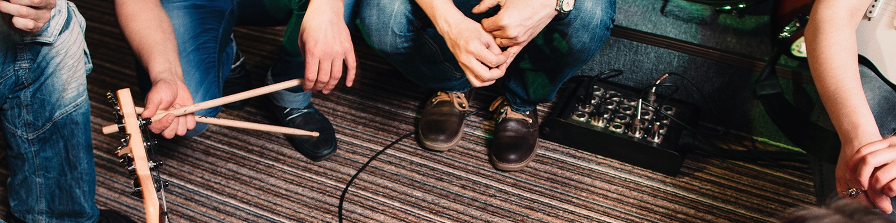
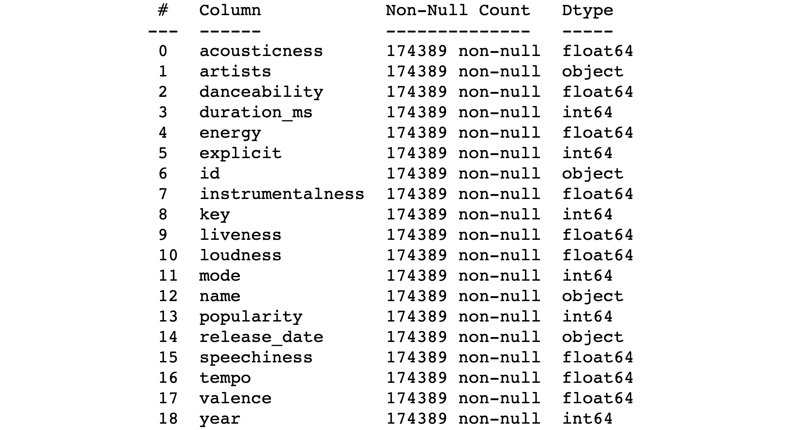
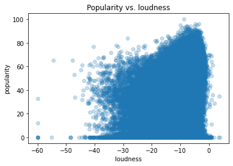
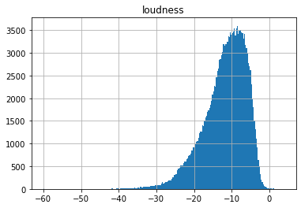
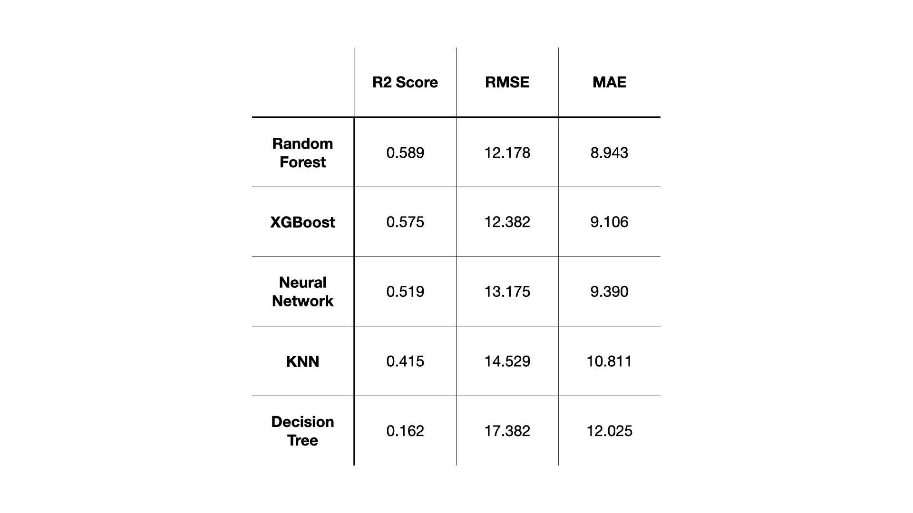

  

# Spotify Popularity Predictive Model
Author: Carlos Garza

## Overview
This project details the building, tuning, and deployment of a model that predicts a song's popularity on Spotify.

Multiple machine learning models were trained using data from the Spotify API and were auditioned using a subset of testing data to determine which model best predicts a song's popularity. 

The model was tuned using a grid search and was deployed in a python script that predicts a song's popularity on a scale of 0-100.

My data, methodology, and derived conclusions are summarized in the body of this document.

## Business Problem
In the music industry, an important metric that has surfaced in the last few years is an artist's Spotify numbers. Many entities in the industry, from venues to record labels, will check an artist's spotify numbers before choosing to work with or book said artist and, for better or worse, will base their decision in part on the artist's performance on the platform.

This increase in Spotify metric importance has opened opportunities for optimization in the pop and Nashville country music workflow. Typically, a producer or songwriter will rent studio time and hire studio musicians to produce singles that can then be pitched to artists. Artists buy these songs and rerecord them with their own studio teams to be released as singles or as part of a record. 

If producers had a model that they could use to evaluate their music while in the production and could deliver a model's predictions while pitching music, they would have a new edge in the industry.

## Data
The data for this project originates from the Spotify API. The data used for this model training was organized and uploaded to Kaggle by user Yamac Eren Ay, and can be found [here](https://www.kaggle.com/yamaerenay/spotify-dataset-19212020-160k-tracks?select=data.csv).

The data describes 174,389 songs.



## Methods
This project utilizes the CRISP-DM framework.

The question presented is if there is a machine learning model that can predict a song's popularity on the Spotify platform.

To acomplish this, data that originated from the Spotify API was borrowed from a Kaggle user for analysis and model training.

The data was first explored and visually analyzed via scatterplots and histograms to find any outlier data or anomalies that may be unaccurate, as well as visually look for trends in data.

Once the data had undergone EDA, it was preprocessed to properly perform in all the models that would be auditioned. Preprocessing included dropping redundant or drastically incomplete columns, dropping the few rows of data that had stand-in values for some columns, one-hot encoding categorical variables, performing a train-test split of the data, and scaling the continuous variable columns.

With preprocessed data, baseline models were created with algorithms including a K-nearest neighbor regressor, a decision tree regressor, a random forest regressor, an XGBoost regressor, and a deep neural network. The models were evaluated using r2 scores and compared by their RMSE and MAE stats.

The model that performed best was the random forest regressor. The model was optimized and cross validated using the brute force GridSearchCV method. The quirks of the final model were explored and deemed to be relevant.

Finally, the final model along with the scaler used in preprocessing and a template dataframe of independent variables were exported as ```.pickle``` files to be deployed in an app. A rough first draft of an interactive app was written as an example of how the model might be used.

## Results
As early as the initial EDA, some trends were visually apparent. as seen in the histogram and scatterplot below, The answer to the "loudness war" is that louder mixes and masters can tend to perform better than quieter mixes. The typical mix tends to be a few decibals quieter than what may be optimal, suggesting a more conscious effort to mix and master louder songs could lead to more success.




Baseline model performance is summarized below. By a narrow margin, the random forest regressor performed best.


After model tuning, the metrics of the model remained relatively unchanged when analyzing performance with the test data but dropped slightly when analyzing performance with the training data, suggesting the model may have been slightly overfit before tuning.


## Conclusions
The model that works best to predict a songs popularity on Spotify is a Random Forest Regressor.

The model developed in this notebook explains the variance of 58% of the data. This model's predictions tend to fall within 8-12 points of the actual popularity score, making this model a potentially invaluable asset to a production team that ghost writes and pitches songs.

The model places a lot of influence on year released, which suggests that a period of music changes the way a song's qualities should be optimized.

Finally, a song's key and even its major/minor voicing has little to nothing to do with its success on the Spotify platform, potentially debunking the idea that different keys illicit different emotions. It may be true to the performing musicians as playing in different places on a keyboard or guitar neck feels different, but to the majority of listeners the even temperment of modern music steralizes any contributing factors a different root note might have on a song's success.

## Future Work
- Refine the model to take a song's genre into consideration.
- Explore the method Spotify uses to quantify continuous attributes like ```danceability```, ```energy```, and ```acousticness```.
- Explore different neural network structures.
- Develop a model that incorporates the future work above and takes input in the form of .wav or .mp3 files, finds song attributes autonomously, and returns a predicted popularity value.

## For More Information
For more detailed information, please review my full analysis in [my Jupyter Notebook](./master_notebook.ipynb) or my [presentation](./project_presentation.pdf).

For any additional questions, please contact me by email: **carlosjgarza89@gmail.com**

## Repository Structure
```
├── README.md                           <- The top-level README for reviewers of this project
├── neural_network_lab.ipynb            <- Neural network experimentation notebook
├── master_notebook.ipynb               <- Narrative documentation of analysis in Jupyter notebook
├── master_notebook.pdf                 <- PDF version of master notebook
├── project_presentation.pdf            <- PDF version of project presentation
├── data                                <- Both sourced externally and generated from code
├── images                              <- Both sourced externally and generated from code
└── deployment                          <- Python script and exported models that predict a song's popularity
```


